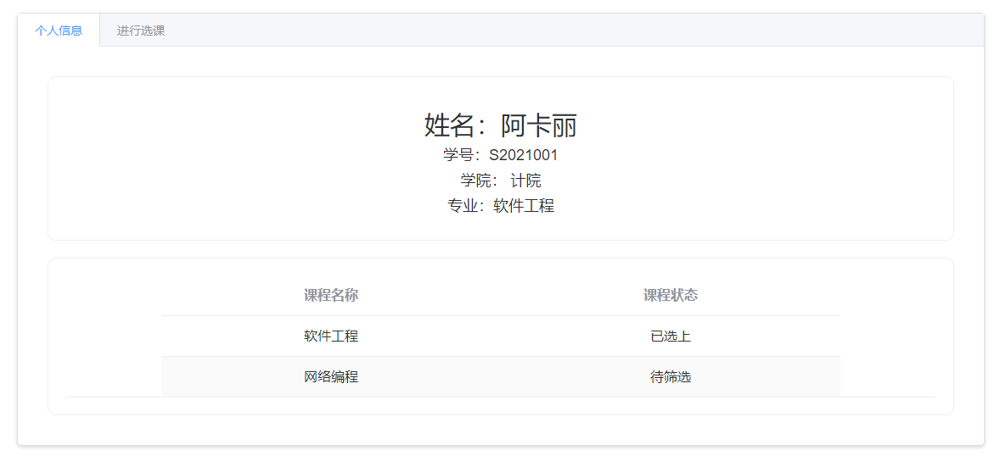

- 服务端开启，开始监听登录人数

    

- 系统的登录页面，教室勾选 `管理`  可进入教师端

    

- 登录以后服务器端就能监听都响应的人数变化

- 如果登录学生端

    - 页面中会显示学生的基本信息，和选课情况

        

    - 点击 `进行选课`，可以查看所属院校下开设的课程，并且可以点击进行选课，等待老师的通过

        

- 如果登录教师端

    - 可以查看所有学生的基本信息，添加学生

        

    - 可以查看正在开放选课的课程，添加课程

        

    - 可以查看学生的选课申请，并点击通过

        

